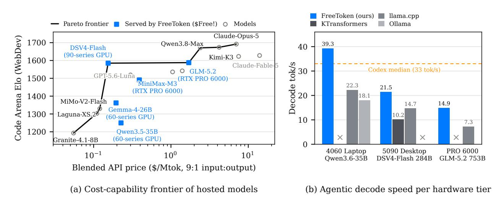

## FreeToken: Efficient Edge-Native MoE Serving with Bandwidth-Adaptive Execution

Shuo Yang∗ , Xiaoze Fan∗ , Melissa Pan, Haocheng Xi, Zhe Wang, Shanlin Sun, Kurt Keutzer, Song Han, Matei Zaharia, Chenfeng Xu† , Ion Stoica†

∗Equal Contribution, †Co-Advise

Frontier open-weight models are increasingly available, but serving them still largely assumes datacenter infrastructure. We present FreeToken, an edge-native MoE serving system that treats a personal machine not as a small GPU, but as a unified, elastic inference platform. FreeToken co-designs the full serving stack, including model layout and loading, expert residency, CPU–GPU execution, agentic state reuse, and runtime memory management, around two realities of local AI: agent workloads continuously change their execution pattern, and edge hardware exposes heterogeneous resources whose balance differs from machine to machine. Rather than committing to a fixed offloading strategy, FreeToken continuously maps computation and model state onto the resources actually available. FreeToken supports more than 20 MoE models and real coding and tool-using agents across hardware ranging from an 8 GB laptop GPU to a single workstation GPU. More importantly, it changes what these machines can practically serve, from a 35B model on a laptop to a 284B model on a gaming desktop and the 753B GLM-5.2 on a single workstation GPU. FreeToken turns open weights into deployable local software, making the machines users already own a practical platform for frontier-scale intelligence.

Correspondence: Shuo Yang at [andy\\_yang@berkeley.edu,](mailto:andy_yang@berkeley.edu) Chenfeng Xu at [xuchenfeng@utexas.edu](mailto:xuchenfeng@utexas.edu)

Code: <https://github.com/FlashML-org/FreeToken>

Download: <https://flashml.ai>

## 1 Introduction

Recent open-weight models, such as Kimi-K3 [\(Kimi Team,](#page-13-0) [2026\)](#page-13-0), GLM-5.2 [\(Z.ai,](#page-14-0) [2026\)](#page-14-0) and DeepSeek-V4- Flash-0731 [\(DeepSeek-AI,](#page-13-1) [2026\)](#page-13-1), are rapidly closing the capability gap with the strongest proprietary systems. Yet releasing model parameters determines only who can obtain a model, not who can afford to run it. Frontier open models still rely on scarce datacenter-class GPU clusters that can cost millions of dollars, and although hosted APIs may be cheaper than comparable proprietary offerings, sustained use remains expensive. As agentic applications sharply increase inference demand [\(Presenc AI Research,](#page-14-1) [2026;](#page-14-1) [Anthropic,](#page-13-2) [2026\)](#page-13-2), this cost becomes particularly burdensome for individual users and small teams. Consequently, the capability gap between open and proprietary models is closing much faster than the accessibility gap between those who can obtain frontier models and those who can use them at scale.

At first glance, this accessibility gap appears to be a hardware problem. Yet more than one hundred million consumer machines already contain discrete GPUs, spanning gaming desktops, workstations, and highperformance laptops.[∗](#page-0-0) Collectively, these machines represent an enormous pool of capable but underutilized compute. The missing piece is therefore not hardware itself, but a serving system that can treat each heterogeneous consumer machine as a unified inference platform and automatically map its GPU, CPU, memory, and interconnect resources to the strongest model configuration it can run efficiently.

MoE architectures open a new path toward serving frontier-scale open-weight models on edge devices. An MoE layer contains hundreds of experts while routing each token through only a small subset. DeepSeek-V4-Flash, for example, activates 6 of 256 routed experts in each of its 43 layers, so only 13B of its 284B parameters

∗Steam alone reports more than 200 million monthly active users, with discrete NVIDIA GPUs present in roughly 72% of surveyed systems [\(Simon Carless \(GameDiscoverCo\), reported by gHacks,](#page-14-2) [2026;](#page-14-2) [Valve Corporation,](#page-14-3) [2026\)](#page-14-3).

Figure 1 FreeToken serves the models on the cost–capability Pareto frontier, at interactive speed on consumer hardware. (a) Blended API list price (9:1 input:output mix, following the token economics measured on real coding-agent traces [\(Zhu et al.,](#page-15-0) [2026\)](#page-15-0)) versus Code Arena Elo [\(LMArena,](#page-14-4) [2026\)](#page-14-4) for representative hosted models. Blue squares mark models FreeToken serves, tagged with the consumer GPU class that serves them; the frontier segment from DeepSeek-V4-Flash to GLM-5.2 is exactly this set. Kimi-K3 releases open weights but exceeds consumer memory (594 GB); Qwen3.5-35B stands in for its successor Qwen3.6-35B, which has no arena rating yet. (b) Mean decode throughput on real agentic workloads for the strongest model each hardware tier holds (coding agents on the first two tiers, a math agent on the third), against actively maintained edge engines. The dashed line marks the median decode speed of Codex in production traces (33 tok/s [\(Zhu et al.,](#page-15-0) [2026\)](#page-15-0)); × marks configurations an engine cannot serve.

participate in any single token. At the deployed precision, this active parameter footprint fits within the 32GB memory capacity of an RTX 5090. However, sparsity reduces per-token computation without proportionally reducing the memory required for the complete expert pool. The full model may still exceed GPU memory by a wide margin, forcing inactive experts to reside in host memory or secondary storage and enter the execution path on demand. MoE therefore creates both the opportunity and the central systems challenge for frontier inference on personal hardware: sparse activation makes the computation feasible, while the full expert pool makes efficient serving difficult.

A growing ecosystem of serving systems has begun to bring powerful open-weight models to personal hardware, including llama.cpp [\(Gerganov et al.,](#page-13-3) [2023\)](#page-13-3),KTransformers [\(KVCache-AI Team,](#page-13-4) [2025\)](#page-13-4), and Ollama [\(Ollama](#page-14-5) [Team,](#page-14-5) [2023\)](#page-14-5). Yet these existing systems address only fragments of the edge MoE serving problem and fall short in three dimensions that prevent edge serving from reaching its theoretical capacity:

- First, prefill largely destroys the working-set sparsity in MoE. Although each token activates only a few experts, the union of routes across a long prompt often covers most experts in every layer, turning the expert working set effectively dense. This creates both computational and memory-movement challenges, as experts exceeding VRAM must be repeatedly streamed from host memory. This problem is particularly severe in agentic tool-calling workloads, where long and continuously growing contexts trigger frequent prefills; yet, existing edge serving systems provide little support for hiding expert movement or reusing recurrent state across turns.
- Second, decode presents the opposite regime: each token activates only a sparse subset of experts, but cache misses require experts to be repeatedly loaded, evicted, or executed from host memory. Existing systems lack a principled policy for serving these misses. Static placement cannot follow token-level routing changes, while prediction and prefetching may reduce the miss rate but do not determine how unavoidable misses should be divided between PCIe transfer, GPU execution, and direct CPU execution.
- Third, these two problems are amplified by the diversity and variability of edge resources. Unlike datacenter deployments, consumer hardware differs widely in GPU capacity, PCIe bandwidth, hostmemory bandwidth, CPU capability, and available VRAM. These resources are also rarely dedicated exclusively to model serving: users may run browsers, games, and other applications concurrently,